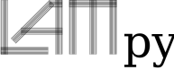

<p align=center></p>

# LamPy 

**classical LAMinate theory for the lightweight design of structures and systems in PYthon**

**Klassische Laminattheorie für Leichtbau-Strukturen und -Systeme in Python**

**Teoria classica dei laminati per la costruzione leggera di strutture e sistemi in Python**


## Installation
### Prerequisites
Python 3 and you can install the necessary libraries via PIP:
```
pip install scipy
pip install numpy
pip install matplotlib
pip install tikzplotlib
pip install pandas
```

### Install
```
python setup.py install
```

### PIP
You can also install LamPy via PIP
```
pip install LamPy
```

## Assumptions:
    Kirchhoff kinematic assumptions
        Normals to the neutral plane remain normal after deformation
        Normals remain straight after deformation
        Thickness remains the same after deformation
    Ideal bonding
        No height of bonding between plies
        Plies cannot slip relative to eachother, no shear deformation
        The strength between plies is infinite
    Geometry
        Constant uniform thickness
        Thin, i.e. b, w >> 10 x thk
        Small displacement u_z << thk and small rotations

## Furture plans:
    Add documentation including list of all nomenclature with meaning
    Different material parameters for each ply as array
    Material library
    Plot Young's modulus of each ply
    Top and Bottom characterisctics in an array for each ply
    Set warning if material properites have strange values
    Add thermal properties
    Add moisture properties

## Main source:
    Jones (1999) Mechanics of composite materials

## Further references:
    http://kmjespersen.sci-life.com/laminate-theory-example-using-python-notebook/
    https://github.com/joaopbernhardt/lamipy
    https://github.com/Eacaen/CLT-material-properties
    https://github.com/kemeen/material_mechanics
    http://kmjespersen.sci-life.com/laminate-theory-example-using-python-notebook/
    https://wstein.org/edu/2010/480b/projects/05-lamination_theory/
    
## Authors
E. M. Gioia and E. J. Wehrle

